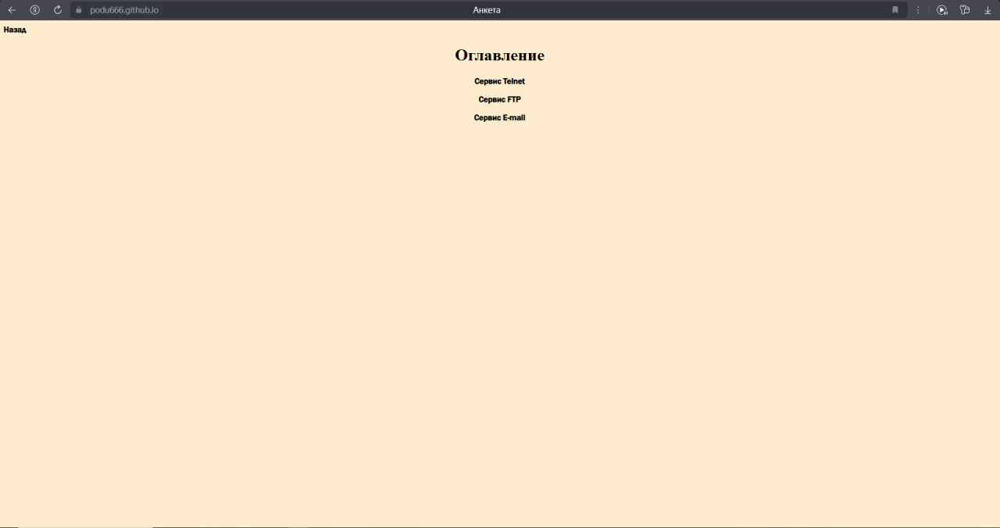
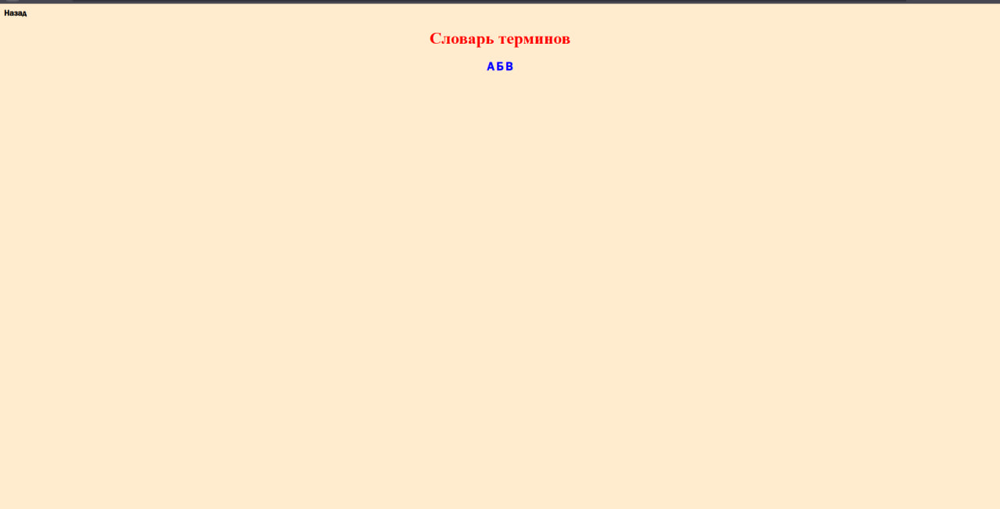

# Проверка домашнего задания (Гиперссылки) Шкарупы Егора
### Задание 4 должно было включать в себя анкера. У Егора же – это ссылки на отдельный сайт с определениями терминов

### В задание 7 та же проблема. Буквы - анкера, которые должны были перекидывать на определения при нажатии. Сами же определения должны были состоять из ссылок, перекидывающие на сайт википедии

### Больше недочетов в работе я не нашел (помимо пнг картинок и прочих мелочей) 