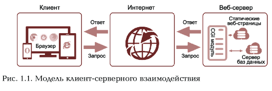

# Глава 1 Основы веб-технологий
## 1.1 Введение в основы веб-технологий
### 1.1 Термины и определения испольуемых в веб-технологиях
* ***Веб-технологии*** - программные, аппартаные, вычислительные методы и средства организации взаимодействия между пользователями в глобальной сети.

* **Основная цель** применения возможностей веб-технологий при создании веб-сайтов заключается в создании простых, понятных, дешевых, гибких, человкоориентированных систем и интерфейсов с использованием классических и современных методов, стандартов ,средств , эргономики, дизайна и компьютерной графики. 

* ***Интернет*** - компьютерное информационное пространство, глобальная сеть, функционирующая по определенным  правиллам и стандартам, объединяющая абонентов разных стран и континентов, включающая множество точек, узлов, представленных в виде серверов, компьютеров, ноутбуков и других устройств по всему миру

* ***веб-сервис*** (Web service) - ресурс сети, предоставляющий информационное наполнение и (или) функциональные возможно-сти, к которым можно обратиться дистанционно через стандар-тизированные протоколы и программные интерфейсы 

* ***веб-приложение*** (Web application, World Wide Web application) - приложение, предоставляющее функциональные возможности пользователю через браузер или другой тип агента пользователя. использующего веб-форматы и протоколы

* ***сайт, веб-сайт*** (website, site) - последовательный набор взаимосвязанных ресурсов сети (например, веб-страниц или веб-сервисов), который размещен на одном или нескольких ком-пьютерах, подключенных к Интернету, и к нему можно обращаться через совокупность спецификаций того же домена URL

* ***веб-страница*** (Web page) - последовательное представление объекта или набора объектов информационного наполнения и связанных с ними объектов взаимодействия через агента пользователя 

### 1.1.2. Организация клиент-серверного взаимодействия в Интернете

***Глобальные сети*** являются открытыми и ориентированными на обслуживание любых пользователей. Существуют и другие виды сетей, такие как локальная, региональная, корпоративная. Все имеющиеся варианты сетей могут быть присоединены к глобальной сети, если это не противоречит интересам участников взаимодей-ствия, которыми могут быть физические и юридические лица.

***Програмочное обеспечение (ПО)***  килентов может включать бро-тер, почтовые приложения, мультимедийные средства кинетова модули систем грушовой работы и т.д. 

Взанмодействие в Интернете происходит по определенному алгоритму: клиент запрашивает зеб-страницу с определенным адрести в ответ на запрос килента формируется веб-страница и отараз-ется сервером клиенту.  
***Адреса*** запрашиваемых документов содержатся в их URL
***Названия протоколов*** ачале адреса, например:ставится в начале адреса, например:
https://int.ss.aw.com/catalog.html

В соответствии с пп. 4 п. 2 ст. 1484 Гражданского кодекса Рас-сийской Федерации (ГК РФ) доменное имя является способом адресации в Интернете. Согласно п. 15 ст. 2 Федерального закона: от 27 июля 2006 г. Лº 149-03 «Об информации, информационных технологиях и о защите информации» доменное имя — обозначает символами, предназначенное для адресации сайтов з Интернет: в целях обеспечения доступа к информации, размещенной в Интернете.  

***Домены***  классифицируются и различаются по уровням. К доменам первого, верхнего, уровня относятся территорнальные и внетерриторнальные.   
*Территориальные* относятся к какой-то стрне и для индетификации используют двухбуквенные аббревиатуры ru (РФ), us (США), fr (Франция) и т.д; внетерриториальные - к разным организациями.
В зависимости от специфики предметной области организаций используется аббревиатура, состоящая из трех знаков букв латинского алфавита, например:
- сетевые организации - net
- некоммерчисекие организации - org
- коммерческие организации - com
- образовательные организации - edu
- домен, открытыйы для всех - info
- для персональных сайтов - name
- для специалистов определенных - gov *Территориальные* 

Рассмотрим концептуальную модель **клиент-серверного взаимо-
действия** в Интернете. На рис. 1.1 показана модель взаимодействия
и формирования динамической страницы по запросу пользователя.
Базы данных и специальные программы (сценарии, скрипты), на-
находящиеся на веб-сервере, генерируют данные по запросу. Запрос
с компьютера пользователя, переданный на сервер, обрабатывается
программой, после чего создается веб-страница и передается об-
ратно на компьютер пользователя. Все это формируется с помощью
CGI-модуля и по правилам, по которым сервер передает запрос
программе.  
Страница, созданная заранее, является *статической*. Для соз-
дания *динамической* страницы модуль может использовать любые
данные, доступные ему в настоящий момент времени, например ре-
результаты поиска в базе данных. Благодаря этому свойству можно за-
ранее обеспечить гибкие интерактивные возможности веб-сервера.
 