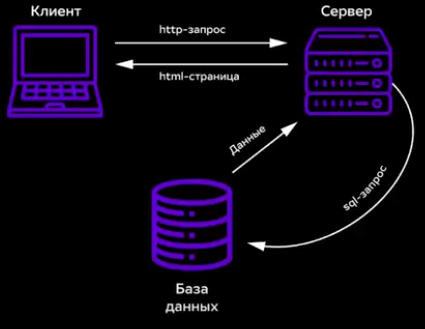
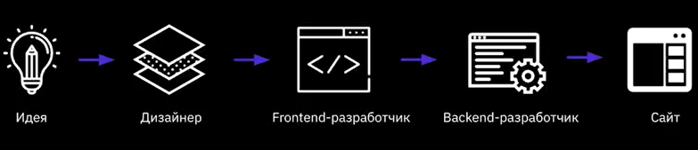

### Что такое HTML?

**HTML** - стандартный язык разметки документов во Всемирной паутине.   

Язык **НТМL** интерпретируется браузерами; полученный в результате интерпретации форматированный текст отображается на мониторе компьютера или экране мобильного устройства.

### Что такое CSS?
**CSS** - каскадные таблицы стилей, формальный язык описания внешнего вида документа, написанного с использованием **HTML** 

### Что такое интернет? 
Всемирная информационная компьютерная сеть, связывающая между собой как пользователей компьютерных сетей, так и пользователей индивидуальных компьютеров для обмена информацией.

### Браузеры 
Прикладное программное обеспечение для просмотра веб-страниц; содержания веб-документов, компьютерных файлов и их каталогов; управления веб-приложениями, а также для решения других задач. 

### Виды сайтов 
1. **Резиновые** - дизайн, в котором ширина столбца/рисунка задана в процентах от текущего разрешения экрана.  
2. **Фиксированной ширины** - дизайн (табличный либо блочный), в котором ширина столбца/рисунка заданы в пикселях, то есть оговорены точно.  
3. **Адаптивные** - дизайн, который подстраивается (адаптируется) под размер экрана, в том числе может происходить перестройка блоков с одного места на другое или их замена блоками, отображаемыми только при определенном разрешении.

#### По содержимому 
**Статические** - содержимое подготавливается заранее и выдается пользователю в том виде, в котором хранится на сервере.  
**Динамические** - содержимое генерируется при помощи серверных языков программирования.

#### Основные протоколы 
**HTTP** (Hypertext Transfer Protocol)  
**HTTPS** (Hypertext Transfer Protocol Secure)  
**FTP** (File Transfer Protocol)  

### Схема HTTP-запроса страниц
 

### Процесс разработки дизайна 

### Парные тэги  
 <название тега> текст  
внутри тега </название_тега>  

1. <р>Текста параграфа

2. <b>Жирный текст</b>
3. <i>Курсивный текст</i>
(p - параграф)

### Одиночные тэги
 <название_тэга>    
1. <br\> - перенос строки (break)  
2. <hr\> - горизонтальная черта (horizontal rule)

### Альтернативный метод - **Типограф**

**Типограф** - это средство онлайн подготовки текста к веб-изданию.  

Он помогает избежать ручной замены огромного количества текста, расстановки кавычек, неразрывных пробелов,
всевозможных символов, которых нет на клавиатуре.  

### Списки

#### Маркированные Списки 

<ol>
<li>Первый элемент</li> 
<li>Второй
элемент</li>
<li>Третий элемент</li>
</ul>

 Внешний вид на сайте:  
1. Первый элемент   
2. Второй элемент  
3. Третий элемент  

## Ссылки 

### Типы ссылок
<ol>
<li>Относительные ссылки</li> 
<li>Абсолютные ссылки</li>
<li>Якоря в гиперссылках</li>
</ul>

### Заголовки 
<h1> - большой
<h2> - поменьше
<h3> - еще меньше 
