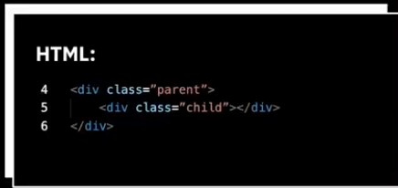

# Основы СSS

## План урока
1. Псевдоклассы и псевдоэлементы
2. Работы с svg
3. Эффекты перехода
4. Эффекты трасформации
5. Эффекты анимации
 ### Псевдокалссы 
__Псевдоклассы__ - это атрибуты, назначаемые строго к селекторам с намерением определить реакцию или состояние для данного селектора.
### Определяющие элементы 

### Структурные псевдоклассы 

### Добавление стилей к дочерним элементам 

При инаведении на блок с классом "parent" у дочерного элемента с классом "child" цвет фона изменится на синий 

## Комбинирование псевдо-классов
При наведении на посещенную ссылку цвет текста будет зеленым.

### Псевдоэлементы 

### Пример добавления псевдоэлемента after

## Использование формата графики SVG
### Преимущества SVG

При масштабировании SVG не теряет в качестве,
увеличивается скорость загрузки сайта из-за
уменьшение HTTP-запросов.

При использовании CSS можно менять параметры
графики на сайте, например, фон, прозрачность
или границы.

С использованием javascript можно анимировать
SVG.

Минимальный размер файла формата SVG

### Добавление SVG на сайт 

* Использование тега ``

Пример: ``

* Использование тега `<object>`

Пример:``<object type="image/svg+xml"
data="image.svg"></object>``

* Использование тега `<iframe>`

`<iframe src="Svg Img.svg"></iframe>`

* Использование встраиваемого `<svg>`

Добавление с использованием css
свойства `background-image`
\
## Свойство tansition

* Переходы осуществляют плавные переходы
при смене одного значения свойства
на другое.

* Часто используется для стилизации эффектов
наведения или активации элемента.  

* Также дают возможность контролировать
плавность изменения CSS-свойств при
анимации элементов.
### `transition-property`
Название свойства, к которому будет применяться эффект трансформации. 
### `transition-duration`
Промежуток времени, за которое происходит изменение элемента 
### `transition-timing-function`
Функция, определяющая скорость перехода объекта из одного состояния в другое.
### `transition-delay`
Изменение происходит не сразу, а по истечении времени (необязательно свойство).

## Свойство transaorm

* Трансформации изменяют размер, форму и положение элемента.  

* Трансформации преобразовывают элемент, не затрагивая остальные элементы. 

* По умолчанию трансформация происходит относительно центра элемента.  

* Трансформации не действуют на строчные элементы display: inline.

### `translate(x,y)`

Смещает элемент относительно его положения, используя указанные значения х, у.

### `scale(x, y)`

Дает возможность изменить масштаб элемента, первое значение отвечает за изменения по ширине, второе по высоте.

### `rotate(deg)`

Поворот элемента на указанное значение градусов, возможно указать отрицательные значения и на несколько оборотов.

### `skew(x-deg, y-deg)`

Искажение сторон элемента относительно координатной оси, возможно указать только одно значение, второе будет рассчитано автоматически.

### Особенности animation

* С помощью анимации можно оживить
веб-страницы .

* Добавить обратную связь с пользователем,
эмоциональность и индивидуальность.

* Анимация применяется к любым
html-элементам, а также к псевдоэлементам.