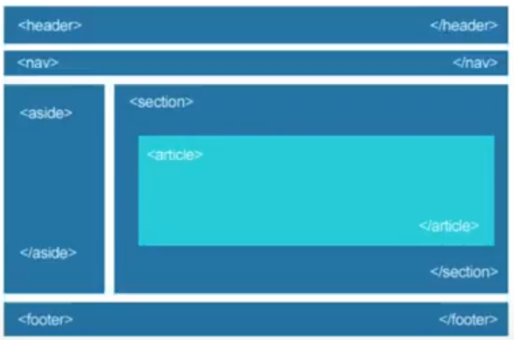

# Новые возможности html5
 ## План урока

 1. Новые симантические элементы
 2. Модерация стандартной html формы
 3. Добавление аудио и видео на страницу 

 # Новые симантические элементы
## Для чего необхдим новый способ структурирования страниц?
1. Более удобное редактирование и споровождение 
2. Оптимизация поисковых движков
3. Поддержка будущих возможностей 
## Симантические элементы для работы со структурой страниц 
### <__header__>
Шапка сайта или раздела, в которой может распологаться один или несколько заголовков, группа навигационных цепочек, информация об авторе.
### <__nav__>
Группа навигационных цепочек (меню сайта).
### <__main__>
Основное, уникальное для каждой страницы, содержимое сайта. 
### <__footer__>
Подвал сайта или раздела, где может содержаться информация об авторе, навигационная цепочка или контактная информация.
### <__section__>
Логическая область страницы, применяется для новостей, блоков информации. Раздел чаще всего содержит заголовок.
### <__article__>
Раздел контента, который образует независимую часть документа или сайта, например, статья в журнале, запись в блоге, комментарий.
### <__details__>
Виджет, который пользователь может открыть или закрыть. 
### <__summary__>
В этот тег заключается текст, который необходимо скрыть.

### Устройство сайта

## Семантичесие элементы для работы с текстом 
### <__time__>
Определяет дату, время, например, для выделеня даты создания статьи или контента, регистрации на сайте.
### <__wbr__>
 Место разрыва длинной строки. 

 ## Усовершенствование традционных форм 
  
 ### Аудио HTML5
 HTML5- элемент <__аудио__>
 используется для внедрения звукового контента в веб-страницах 
 ### controls
 Добавляет отображение барузерами интерфейса управления аудио плеера - кнопки воспроизведения, паузы, громкости
 ### autoplay
 Автоматически запускает на странице аудио файл
 ### loop 
 При завершении композиции она запуститься вновь. 
 ### muted
 Отключает звук
 ### preload
 Какую часть аудио-файла требуется загрузить браузеру для ускорения запуска аудиозаписи.
 ### scr 
 Указывает путь к файлу.
### Воспроизведение видео 
С помощью элемента <__video__> появилась возможность добавлять видео-содержимое
на веб-странице, а также стилизовать внешний вид видео-плеера при помощи css-стилей.

### Семантические элементы для работы со структурой страниц 
__Тег <_video_>__, применяет такие же атрибуты scr, controls, autoplay и loop, которые мы рассмотрели ранее.  
___poster___ Выставляет изображение, которое браузер будет использовать, пока браузер загружается.  
### Атрибут preload 
### __auto__
Браузер загружает видеофайл полностью, чтобы он был доступен, когда пользователь начнет его воспроизвеление.
### ___metadata___ 
Браузер загружает первую небольшую часть видеофайла, чтобы определить его основные характеристики.