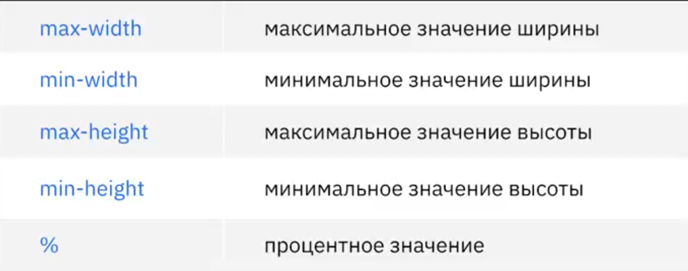

# Основы создания адаптивного сайта 

## План урока 
1. Понятие адаптивного сайта
2. Эмуляция мобильных устройств в браузере 
3. Новые параметры ширины и высриы 
4. Единицы измерения ширины и высоты устройства 
5. Медиа-запросы

### Что такое адаптивный сайт?
## Позиционирование блоков 
### Новые параметры ширины и высоты 

### Единицы измерения щирины и высоты устройства 
 

### Эмуляция мобильных устройств в браузере 
## Медиа-запросы
### Что такео медиа-запросы
__Медиа-запросы__ - фильтры, которые можно применить к стилям CSS, позволяющие изменять стили на основании характеристик устройства.
1. Разрешение экрана. 
2. Ширина.
3. Высота.
4. Ориентация экрана. 
### Часто используемые медиа-запросы 

### Условия для Media Queries

