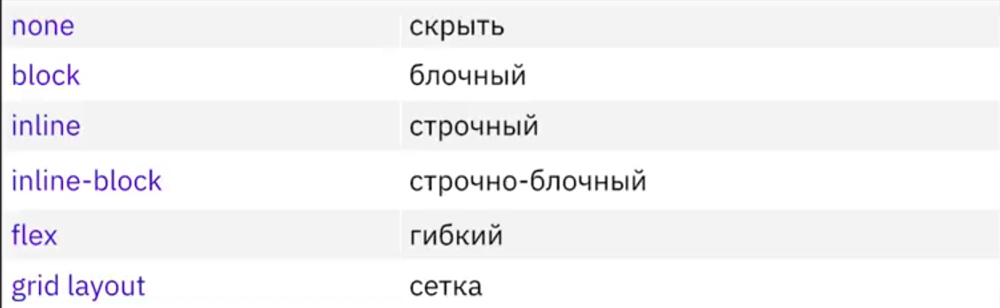
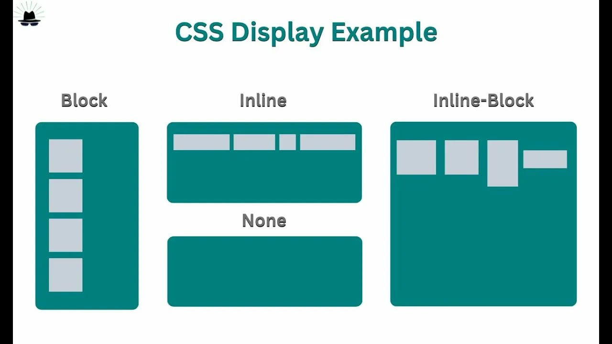
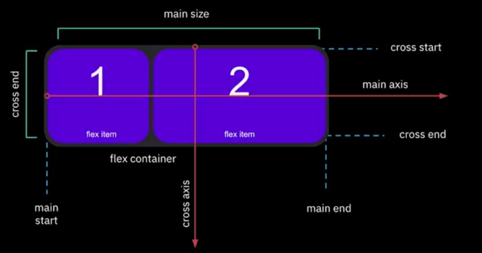
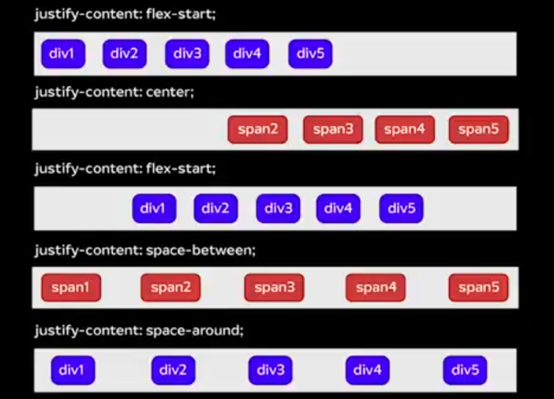
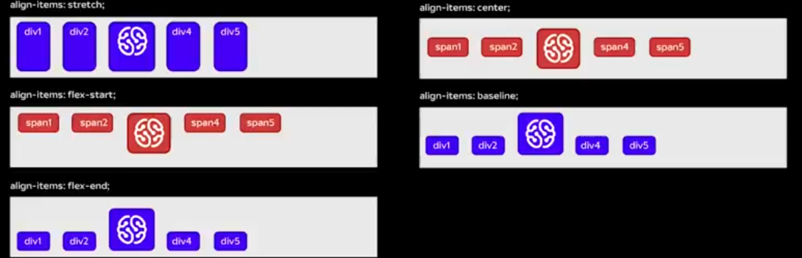
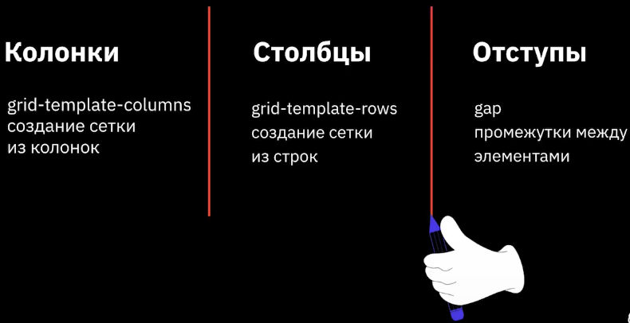

# Основы позиционирования

## План урока 

1. Cвойства display
2. Flexbox i Grid layout
3. Позиционирование блоков

## Значения свйойства display
 

## Значенние __inline-block__
#### Элемент находится в строке, но при этом ему может быть задано значение ширины и высоты.
* Можно задать свойтсва width, height.
* Является частью строки.
* Размер является по содержимому, если не заданы значения шириныи высоты.
* Элемент всегда прямоугольный. 

## Значение **flex**
#### Наделение контейнера способностью изменять ширину или высоту для поддержки всех видов дисплеев и разных разрешений экранов 
__1.__  Элементы могут сжиматься и растягиваться, занимая необходимое пространство.  
__2.__ Возможно выравнивание не только по вертикали, но и по горизонтали.  
__3.__ Элементы могут автоматически встраиваться в несколько строк.  
__4.__ Возможность формирования блоков справа налево. 

## Основы __flexbox__
 

## Синтаксис CSS
__1.__ Главная ось (main axis) и перпенедикулярная ось (cross axis)  
__2.__ Начало (main-start) и конец (main-end) направление главной оси   
__3.__ main size и cross size - ширина или высота flex-элемента  
__4.__ cross-start и cross-end - начало и конец вертикольной оси 

## Распространение эелментов по горизонтали  
 
 
**кстати топои сайт с обучалками ___flexbox froggy___**
 # Основы Grid
 ## Особенности Grid 
 __1.__ Распределение элементовне только горизонтально, но и вертикально  
 __2.__ Объединение ячеек по горизонтали и вертикали   
 __3.__ Гибкая адаптивная сетка для создания проектов любой сложности   
 __4.__ Хорошая поддержка браузерами  
### Основные понятия 
1. __Линии сетки__ (grid lines) - это невидимые горизонтальные и вертикальные разделительные линиии  
2. __Дорожка сетки__ (grid tracki) - это пространство между двумя соседними линиями сетки   
3. __Ячейки сетки__ (grid cell) - это пространство, ограниченное четырьмя линиями сетки   
4. __Элементы сетки__ (grid items) - это отдельные элементы, которые назначаются областями сетки

 
 ### Единицы измерения 
 * px
 * %
 * fr
 * auto 

 ## Что такое позиционирование?
__Позволяет точно определить, где появятся блоки относительно окна браузера или других объектовна веб-странице.__